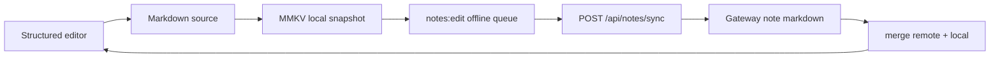

# Note Editor — Markdown + AI Native Redesign

xopc-app 的笔记编辑器对标 Obsidian：**Markdown 是用户与 AI 共同理解的文档格式**，移动端提供结构化、顺滑的编辑体验。编辑器不应退化成整篇 Markdown 源码输入框，也不应把服务端主模型切到 Notion 式私有 block schema。

目标状态：**用户看到的是一张可直接书写的文档，Markdown 是底层能力与高级入口，AI 以 Markdown range / section 为主要操作单元**。

---

## Product Goals

| 目标 | 说明 |
|------|------|
| Obsidian-like | Markdown 文件感、源码可达、链接/标签/大纲可扩展，但不把普通用户暴露在源码和模式概念里 |
| Mobile-first | 阅读清爽，编辑不跳键盘，不丢光标，常用动作拇指可达 |
| AI-native | AI 能对选区、段落、章节、整篇 note 做可预览的修改 |
| Content-first | 页面 chrome 克制，正文和结构层级清晰，默认不展示技术化模式切换 |
| Local-first | 弱网和离线下编辑不丢失，后台同步 |

---

## Non-goals

- 不做纯富文本黑盒编辑器；用户必须能进入 Markdown 源码模式。
- 不把 Gateway 的长期主模型切到 `NoteBlock[]`。
- 不在首版做复杂嵌套块、拖拽排序、CRDT 协作或完整插件系统。
- 不用 WebView/Tiptap/ProseMirror 作为移动端核心编辑栈，除非后续专项验证收益大于原生复杂度。

---

## Information Architecture

Note detail 页面面向普通用户只有一个主对象：文档本身。内部仍有阅读、结构化编辑、Markdown 源码三层，但 UI 不应把它们做成常驻并列 tab。

### Product Interaction Principles

- 默认展示内容，点击编辑后直接进入结构化正文编辑；不要常驻显示“预览 / 编辑 / Markdown”分段控件。
- 普通用户只需要看到“编辑”“完成”“AI”“更多”。Markdown 源码放在更多菜单和 raw/image 精确编辑入口。
- 阅读正文区只承载文档内容，不放搜索 / 大纲 / 链接 / 分享等工具 chip；这些动作放 Header 或「更多」。
- 阅读态主动作使用底部居中的浮动 action dock，最多展示 3 个图标按钮，最后一个固定为「更多」；超过三个动作全部进入上拉菜单。
- 标题、保存状态、标签是文档元信息，应该轻量展示；不能把正文第一屏挤下去。
- 编辑层必须像连续文档，不像一组独立 block 卡片；内部结构单元只服务解析、AI range、搜索和大纲。
- 每一行正文应紧凑，段落之间主要靠文本行高和 Markdown 结构表达，不靠大块卡片间距或每行控件。
- 底部 action 插入的是语义块，不应把 `##`、`- [ ]` 等 Markdown 符号作为可见交互结果暴露给普通用户。
- 列表、引用、callout 在编辑层使用自然排版符号或样式：bullet 显示 `•`，quote 使用左侧竖线，callout 显示可读标签；不要显示 `-`、`>`、`[!NOTE]` 等源码 token。
- AI、源码等高级能力不应让普通段落行高膨胀；默认正文行距应接近原生笔记应用。
- 不在每一行常驻 AI 按钮。AI 应在用户选中文本、打开上下文菜单、点击顶部 AI 或使用 toolbar 命令时出现。
- AI 是写作动作，不是另一个编辑模式；它可以作用于选区、当前块、章节或全文。

### 1. Reading Layer

默认打开 note 进入安静阅读层：

- 顶部：返回和轻量元信息；主动作放底部浮动 dock。
- 更多菜单：搜索、大纲、链接、Markdown、分享、归档等低频或结构动作。
- 正文：Markdown 渲染后的标题、段落、列表、todo、图片、代码块。
- 底部：无常驻 heavy toolbar；内容优先。
- 点击正文空态或顶部编辑入口进入编辑层；编辑层不再显示模式切换控件。
- 大纲和搜索结果默认跳到结构化编辑层并聚焦对应 block，不应突然切到源码层。
- 搜索命中 raw/image 等结构化层不可安全编辑的范围时，可以回退到源码层并选中对应 Markdown；code block 应留在结构化编辑层。

阅读层必须让普通用户感觉这是“文档”，不是“代码”。

### 2. Structured Editing Layer

编辑层是默认写作体验：

- 文档被解析为轻量 Markdown blocks：paragraph、heading、todo、bullet list、numbered list、quote、callout、code、image。
- 每个 block 以符合类型的视觉样式编辑，但底层仍回写 Markdown。
- 输入 Markdown shortcuts 自动视觉化：
  - `# ` / `## ` / `### ` -> heading
  - `- ` / `* ` -> bullet list
  - `1. ` -> numbered list
  - `- [ ] ` / `- [x] ` -> todo
  - `> ` -> quote
  - `` ``` `` -> code block
- 键盘工具栏提供：标题、todo、列表、引用、代码、链接、图片、AI。
- 长文不使用单个巨大 multiline `TextInput` 承载全部正文。
- 结构化 block 列表使用虚拟化渲染，避免 AI 生成长文或用户粘贴长文后一次挂载全部输入框。
- table、HTML、未闭合代码块等复杂 Markdown 必须原样保留为 raw block；结构化层只做只读预览，点击 raw block 或提示入口切到源码层精确编辑。

### 3. Markdown Source Layer

源码层是 Obsidian-like 的高级逃生口，不是普通用户主路径：

- 显示完整 Markdown 源码。
- 支持复制、粘贴、批量修复、复杂语法编辑。
- 从源码层返回结构化编辑层时重新 parse Markdown。
- parse 失败不丢内容，保留源码并提示用户。
- 只有用户显式点击 Markdown / source 入口时才进入源码层。
- Markdown 入口放在「更多」或 raw/image 精确编辑入口，不作为顶部常驻模式 tab 暴露给普通用户。
- 从源码层切回结构化层时，应优先保留当前源码选区的上下文；若选区在 image/raw 等不可直接聚焦块内，落到后一个可编辑块，没有后续块时再落到前一个可编辑块，避免长文跳回第一块。
- 源码输入框只在程序化跳转 / toolbar 插入后短暂设置 selection；用户正常输入时不得长期受控 selection，避免移动端光标回跳。
- 源码输入框必须有明确的本地化 accessibility label，并关闭自动大写、自动纠错、拼写检查。

---

## AI Interaction Model

AI 是编辑器的一等交互，不是普通弹窗。

| 上下文 | 入口 | 能力 |
|--------|------|------|
| Text selection | 选区浮层 / toolbar | 改写、总结、翻译、变短、变清晰 |
| Current block | selection / contextual tip | 继续写、提取 todo、改成标题/列表 |
| Current section | heading selection / outline context | 总结章节、整理结构、补充内容 |
| Whole note | bottom AI sheet | 生成标题标签、提取任务、整理全文、生成摘要 |

Code block 是结构化编辑层的一等 block：搜索命中、源码返回和 block AI 都应保留在结构化层；raw/image 等不可直接编辑范围才回退源码。

AI 修改流程：

1. 用户给指令。
2. 客户端发送 Markdown + context range / section anchor。
3. Gateway 返回 patch。
4. 客户端展示 patch preview / diff。
5. 用户应用或丢弃。
6. 应用后可撤销。

AI patch 不应默认整篇重写；优先 `replaceRange`、`replaceSection`、`appendSection`、`prependSection`、`updateMetadata`。

首版客户端上下文：

- 有选区时发送 `context.type = "selection"`，包含 Markdown source range 和选中文本。
- 无选区时发送光标所在 heading section：`context.type = "section"`，包含 section range、heading、sectionId。
- 标题相关 AI 必须使用章节上下文，而不是只把标题行作为普通 block 发送。
- 块级 AI 不能以每行常驻按钮呈现；首版先保留顶部/toolbar AI，后续再做选区 tip。
- 无 heading 时回退整篇 note：`context.type = "note"`。
- 阅读态 AI 入口默认发送整篇 note，避免旧光标或历史选区让用户误改局部内容。
- AI sheet 显示当前上下文，避免用户误以为每次都是全文编辑。
- AI sheet 在输入指令前展示短上下文预览，帮助用户确认选区 / 章节 / 全文范围。
- AI sheet 提供上下文相关快捷指令：选区改写/缩短，章节总结/整理，全文整理/标题标签/摘要。
- `replaceSection` 必须使用客户端 outline 生成的 `sectionId`，包括重复标题的 `-2` 后缀，确保 AI patch 精准落到用户看到的章节。
- `updateMetadata.title` 使用 `null` 清空标题；保存层必须把清空表达为显式 metadata 更新，而不是让 `undefined` 在 JSON 序列化中被丢弃。

---

## Data Model

### Canonical Note

Gateway 和本地长期存储以 Markdown 为主：

```ts
interface Note {
  id: string;
  title?: string;
  markdown: string;
  tags?: string[];
  status: NoteStatus;
  attachments?: NoteAttachment[];
  localVersion?: number;
  remoteVersion?: number;
}
```

### Editor Document

结构化编辑层使用临时 editor document，不作为服务端真相源：

```ts
interface MarkdownEditorDocument {
  source: string;
  blocks: MarkdownEditorBlock[];
  parseWarnings: MarkdownParseWarning[];
}

type MarkdownEditorBlock =
  | { id: string; type: 'paragraph'; markdown: string; text: string; range: Range }
  | { id: string; type: 'heading'; level: 1 | 2 | 3 | 4 | 5 | 6; text: string; range: Range }
  | { id: string; type: 'todo'; checked: boolean; text: string; range: Range }
  | { id: string; type: 'bulletList'; text: string; range: Range }
  | { id: string; type: 'numberedList'; index: number; text: string; range: Range }
  | { id: string; type: 'quote'; text: string; range: Range }
  | { id: string; type: 'code'; language?: string; code: string; range: Range }
  | { id: string; type: 'image'; alt: string; src: string; range: Range };
```

`range` 是 AI patch、选区操作和回写 Markdown 的关键。block id 应由稳定位置 + block type 生成，避免用户输入时因内容 hash 变化导致当前输入框重新挂载、光标跳动。

---

## Save and Sync

当前 `PageScreen` 直接 debounce `PATCH /api/notes/:id`。目标方案改为 local-first：



要求：

- 每次编辑先落 MMKV。
- UI 显示保存状态：saving、saved、offline pending、failed。
- 离开页面不阻塞，但必须能在列表/详情里看到待同步状态。
- 冲突处理优先 Markdown merge；无法自动合并时保留本地版本并提示。

---

## Current Codebase Mapping

| 当前模块 | 去向 |
|----------|------|
| `src/features/page/PageScreen.tsx` | 详情页容器，重构为 reading/edit/source 三状态 |
| `src/features/notes/markdown/MarkdownNoteEditor.tsx` | 保留为 source layer 或临时 fallback |
| `src/features/notes/markdown/markdown-patch.ts` | 扩展支持 `replaceSection`、`updateMetadata`、patch preview |
| `src/features/notes/markdown/markdown-document.ts` | Markdown parse/serialize、outline、`[[note link]]` 语义抽取 |
| `src/features/notes/blocks/*` | 复用 UI 思路和 reducer 测试经验，但不作为服务端 canonical |
| `src/features/notes/notes-local.ts` | 改造为 Markdown local-first edit queue |
| `src/features/notes/ai/NoteAiPanel.tsx` | 迁移成 bottom AI sheet + patch preview |
| `src/features/chat/MarkdownView.tsx` | 阅读层渲染复用 |

---

## Mobile UX Requirements

- 触控目标不小于 44x44。
- 编辑 toolbar 使用 `KeyboardStickyView`，不遮挡光标。
- 编辑区底部 padding / keyboard bottomOffset 必须按真实 toolbar 高度计算，避免最后一行被 44px 图标栏遮住。
- 结构化编辑正文使用 `FlashList` + keyboard-aware scroll 容器，保证长文只渲染可见 block，输入时滚动和键盘避让仍由原生容器处理。
- 大纲 / 搜索跳转到结构化编辑层时，虚拟化列表必须先滚动到目标 block，再聚焦或选中文本。
- block 输入时 Enter、Backspace、selection 必须稳定。
- 段落内手打 Markdown 快捷语法必须即时结构化：`## `、`- [ ] `、列表、引用、Obsidian callout、image、fenced code block 都应保留 Markdown 语义并切换到对应块。
- 从 AI / Obsidian 粘贴包含标题、列表、callout、图片、代码围栏的 Markdown 时，应保留原 Markdown 结构，而不是压成普通段落。
- 结构化 Markdown 粘贴不应受当前块类型限制；即使光标在 todo/list/quote 内，明显的 heading/image/code 等 Markdown 也必须按原结构写回。
- 首版结构化编辑在输入值出现多行内容时按 block 类型回写为 Markdown：
  - heading 后续行转 paragraph；
  - todo/bullet/numbered/quote 延续当前 block 类型；
  - callout 后续行继续保留在同一个 Obsidian callout block 内；
  - code 保留原始多行内容；
  - raw 在结构化层不直接编辑，点击进入源码层。
- 结构化编辑维护 focus request：分块后聚焦到新 block，Backspace 在块开头合并到前一块。
- toolbar 插入标题 / 待办 / 图片等块级模板时按当前位置补齐必要换行，避免文档开头多空行或行中直接粘连。
- toolbar 插入空标题 / 空待办时，结构化层应显示为空的 heading / todo 输入位和 placeholder，不能退化成普通段落显示 `##` 或 `- [ ]`。
- toolbar 插入标题 / 待办时，有选中文本应将选区转换为对应块内容，而不是丢弃选区。
- toolbar 将多行选区转换为标题时，首行作为标题，后续行保留为正文，不能压成单行标题。
- toolbar 将多行选区转换为待办时，应生成多条 `- [ ]`，不能压成一条待办。
- toolbar 将多行选区转换为 callout 时，首行作为 callout 标题，后续行作为同一个 callout 的引用正文。
- toolbar 的块分组提供 fenced code block 插入；格式分组的 code 只做 inline code 包裹。
- toolbar 将选中文本包成 fenced code block 时必须保留代码缩进，只去掉首尾空行。
- 图片 Markdown 的 alt 文本必须转义，文件名不能破坏 `` 语法。
- toolbar 插入 bold / italic / code 等 inline 格式时，无选区只插入短占位并选中占位文本，不使用长说明文案污染正文。
- toolbar 插入普通 Markdown link 时，有文本选区用选区做 label 并选中 URL；有 URL 选区用选区做 href 并选中短 label；无选区选中短 label 占位。
- 空 block 使用 transient editor state：按 Enter 后先显示本地空输入位，不写入 Markdown；用户输入内容后再按上下文生成 paragraph/list/quote Markdown。
- 列表/引用 transient 空块再次 Enter 会退出 continuation，变成普通 paragraph 输入位。
- 切换 reading/edit/source 不丢滚动位置。
- 图片显示为可点按 block，源码里仍是 Markdown image。
- 编辑态图片 block 应复用阅读态附件 URL 解析，`xopc-attachment://...` 要显示为实际图片，而不是退成占位文本。
- 图片 block 和加载占位必须使用稳定比例尺寸，避免图片加载前后导致长文滚动位置跳动。
- todo 可直接点 checkbox，同时回写 `- [ ]` / `- [x]`。
- 双链不只依赖手打 `[[title]]`：移动端 toolbar 提供 note 搜索插入，同时允许直接输入未创建的目标标题；有选中文本时插入 `[[target|alias]]`。
- 所有用户可见文案使用 `useMessages()` 和 `src/i18n/locales/`。
- 颜色、间距、圆角使用 `useTheme()` / tokens。

---

## Phased Plan

### P0 — IA and Reliability

- 将 note detail 拆成 reading、editing、source modes。
- 添加保存状态 UI。
- 将 markdown 编辑接入 local-first snapshot / queue。
- 保留当前源码编辑器作为 source mode。

验收：

- 打开 note 默认阅读。
- 点击编辑进入源码 fallback 或基础结构化编辑。
- 弱网编辑不会丢内容。
- 返回页面后能恢复未同步内容。

### P1 — Structured Markdown MVP

- 实现 Markdown parser / serializer MVP。
- 支持 paragraph、heading、todo、bullet、quote、code、image。
- 使用 block-level inputs 替代整篇正文单 `TextInput`。
- 支持 Markdown shortcuts。

验收：

- 常见 Markdown 往返 parse/serialize 不丢内容。
- 长文编辑不卡顿明显优于单个巨大 `TextInput`。
- todo、heading、image 的交互符合移动端预期。

### P2 — AI-native Editing

- Bottom AI sheet 替代普通 Dialog。
- 支持 selected text / block / section / whole note context。
- 实现 patch preview、apply、discard、undo。
- 补齐 `replaceSection`、`updateMetadata`。

验收：

- AI 不会无确认改写全文。
- 用户能看懂要改哪里。
- 应用后可撤销。

### P3 — Obsidian-like Knowledge Layer

- `[[note link]]` 输入与跳转。
- Tags 和 backlinks。
- Note outline。
- 文档内搜索。
- Section anchors for AI and navigation。

验收：

- 用户能从一篇 note 跳到另一篇 note。
- AI 可以引用 note link / heading section 作为上下文。

首版实现边界：

- 阅读层将 `[[Title]]`、`[[Title#Heading]]`、`[[Title|Alias]]` 渲染为内部 note link。
- 编辑 toolbar 提供 `[[ ]]` wiki link 插入，选中文本时可直接包成双链。
- 点击内部 link 通过 notes search 找同名 note 并跳转到 `/items/:id`。
- code fence 中的 `[[...]]` 不会被识别为 note link。
- 文内搜索会命中 code block 内容，但 wiki link 抽取仍忽略 code fence，避免代码样例污染双链关系。
- 阅读层提供 Links 面板：展示当前 note 的 outgoing wiki links，并在打开面板时基于全库 note 详情构建 link index 计算 backlinks。
- 阅读层提供文档内搜索，结果保留 Markdown source range；点击普通文本或 code block 命中进入结构化编辑层并选中匹配范围，不可结构化命中才切到源码层。
- 已有可复用的 Markdown link index 纯逻辑和 query 层 loader；Links 面板当前在客户端临时拉取全库 note 详情做精确 `[[当前标题]]` 匹配，并通过 key-value storage 做短期缓存。note 保存会失效缓存；后续应下沉为本地/服务端增量索引，避免缓存失效后整库重建。

---

## Risks

| 风险 | 对策 |
|------|------|
| 光标跳动 | block id 稳定、局部 state、避免整文档重渲染 |
| Enter 空 block / 自动聚焦下一 block | 空 block 已用 transient editor state；列表/引用 continuation 可退出到普通段落 |
| RN 键盘事件平台差异 | 核心 split/merge 语义放在纯函数，UI 层按平台继续打磨 |
| Markdown 往返丢格式 | parser 只结构化高频块，未知内容保留 raw block |
| AI patch range 失效 | 使用 base markdown hash + section anchor 校验 |
| 高级用户受限 | 源码模式常驻可达 |
| 两套编辑器分叉 | 明确 Markdown canonical，旧 block canonical 文档废弃 |

---

## Validation

自动回归：

```bash
pnpm run test:note-editor
pnpm run typecheck
pnpm run lint
pnpm exec expo export --platform web --output-dir /tmp/xopc-web-export
```

`expo export --platform web` 只证明 bundle 可以构建；不能替代 iOS / Android 的键盘、选区、Modal、safe-area 和滚动验证。

移动端手动 QA（iOS / Android 至少各跑一次，并记录设备、系统版本、输入法、截图或录屏）：

| 场景 | 流程 | 验收点 |
|------|------|--------|
| 打开已有 note | 打开包含 title、tags、status、heading、todo、image、code 的 note | 默认进入阅读层；标题、保存状态、tag/status chip 不遮挡正文；正文第一屏以内容为主 |
| 阅读层 IA | 查看 Header、结构入口和更多面板 | Header 第一层只保留 AI、编辑、更多；Outline/Links 在正文结构入口；Search/Markdown/Share/Archive 在更多面板；所有入口触控目标不小于 44x44 |
| 底部面板返回 | 分别打开 AI、更多、Outline、Links、Wiki Link、Search 面板后点系统返回 / Header 返回 / backdrop / close | 优先关闭当前面板，不直接离开 note；backdrop 可点但不进入辅助树；close button 有可读 label |
| 结构化编辑入口 | 点编辑，输入 paragraph、heading、todo、bullet、numbered、quote | 键盘出现后 toolbar 贴键盘上方；当前输入不被遮挡；toolbar icon 44x44；disabled / selected / checkbox 状态可被读屏识别 |
| Enter / Backspace | 在 heading、todo、bullet、numbered、quote、paragraph 中连续 Enter / Backspace | heading Enter 生成段落；列表类延续；空列表再 Enter 退出到普通段落；块开头 Backspace 合并上一块且光标在合并点 |
| Toolbar 插入 | 选中文本后点 heading、todo、code block、bold、italic、inline code、link、wiki link、image | 块级操作保留选中文本为内容；inline 操作选中短占位或 URL；图片 alt 不破坏 Markdown |
| Source mode | 从更多进入 Markdown；从图片块、raw 搜索结果进入源码 | 显示完整 Markdown；源码输入关闭自动大写/纠错/拼写；目标 range 被选中；返回编辑层不丢内容 |
| 文内搜索 | 从更多打开搜索，搜索普通段落和 code/raw/image 文本 | 输入框自动聚焦，return key 为 search；普通/code 命中进入结构化编辑并聚焦；不可结构化命中进入源码并选中 |
| Wiki links | toolbar 打开 wiki link picker，搜索已有 note，插入未创建标题，阅读层点击 `[[Title]]` | picker 自动聚焦；有选中文本插入 `[[target|alias]]`；Links 面板显示 outgoing 和 backlinks |
| AI sheet | 从阅读、选区、章节里分别打开 AI；点 quick action；生成 preview；Apply / Discard / Undo | 显示 selection/section/note 上下文和短预览；quick action selected 状态可读；preview 显示变化片段；Apply 后落到变化位置；Discard 不改正文；Undo 恢复正文和 metadata |
| Local-first | 开启飞行模式编辑正文、标题、tag/status 后返回再打开 | 显示 offline pending / failed；本地内容不丢；恢复网络后可同步并刷新列表缓存 |
| Long note | 使用 100+ blocks、多个 heading、todo、image、code 的长文 | 滚动、编辑、Outline/Search 跳转、打开/关闭 sheet 无明显卡顿；键盘收起/展开不导致布局跳动 |
| Accessibility smoke | VoiceOver / TalkBack 浏览 Header、toolbar、todo、AI quick actions、bottom sheets | 返回、关闭、更多、AI、编辑、toolbar actions 有 label；checkbox 读出 checked；selected quick action 读出 selected；无名 backdrop 不被聚焦 |

当前未自动化的高风险项：

- RN `TextInput` 的 Enter、Backspace、selection 在不同输入法和平台上行为可能不同。
- `KeyboardStickyView`、`KeyboardAwareScrollView`、`Modal` 的组合需要真机确认键盘避让和 safe-area。
- FlashList 长文跳转和 TextInput focus request 需要在 iOS / Android 上分别确认。

---

## Decision

采用 **Markdown-first structured editor**。

`NoteBlock[]` 可以作为移动端编辑器的临时 UI 表示，但不能成为 Gateway 长期唯一真相源。产品体验对标 Obsidian：Markdown 可掌控，阅读清晰，移动端编辑顺滑，AI 修改可预览、可撤销、可追踪。
